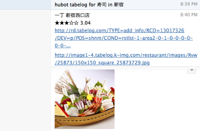

# Hubot Tabelog

[![NPM Version][npm-image]][npm-link]
[![Dependency Status][deps-image]][deps-link]
[![Build Status][build-image]][build-link]
[![Coverage Status][cov-image]][cov-link]

Pick up a restaurant to go randomly



## Installation

* install this npm package to your hubot repo
    * `npm i --save hubot-tabelog`
* add `"hubot-tabelog"` to your `external-scripts.json`

## Usage

* `hubot tabelog <lunch|dinner> for <keyword> in/at <area>`
* e.g. `hubot tabelog lunch for 焼肉 in 新宿`

You can omit any of those like the followings.

* `hubot tabelog`
* `hubot tabelog for <keyword>`
* `hubot tabelog in/at <area>`

## Configuration

You can set some environment variables for hubot-tabelog.

### `HUBOT_TABELOG_PROXY`

Use proxy to access Tabelog

e.g.

```bash
HUBOT_TABELOG_PROXY=http://your.proxy.host:port hubot
```

You can pick up a free proxy listed [here](http://www.getproxy.jp/).

## Known Issues

- Some environments are disallowed to access Tabelog

You might be able to access with proxy.

## Contributing

1. Fork it
2. Create your feature branch (`git checkout -b my-new-feature`)
3. Commit your changes (`git commit -am 'Add some feature'`)
4. Push to the branch (`git push origin my-new-feature`)
5. Create new [Pull Request](../../pull/new/master)

## Copyright

Copyright (c) 2014 Daisuke Taniwaki. See [LICENSE](LICENSE) for details.


[npm-image]:   https://badge.fury.io/js/hubot-tabelog.svg
[npm-link]:    http://badge.fury.io/js/hubot-tabelog
[build-image]: https://secure.travis-ci.org/dtaniwaki/hubot-tabelog.png
[build-link]:  http://travis-ci.org/dtaniwaki/hubot-tabelog
[deps-image]:  https://david-dm.org/dtaniwaki/hubot-tabelog.svg
[deps-link]:   https://david-dm.org/dtaniwaki/hubot-tabelog
[cov-image]:   https://coveralls.io/repos/dtaniwaki/hubot-tabelog/badge.png
[cov-link]:    https://coveralls.io/r/dtaniwaki/hubot-tabelog

